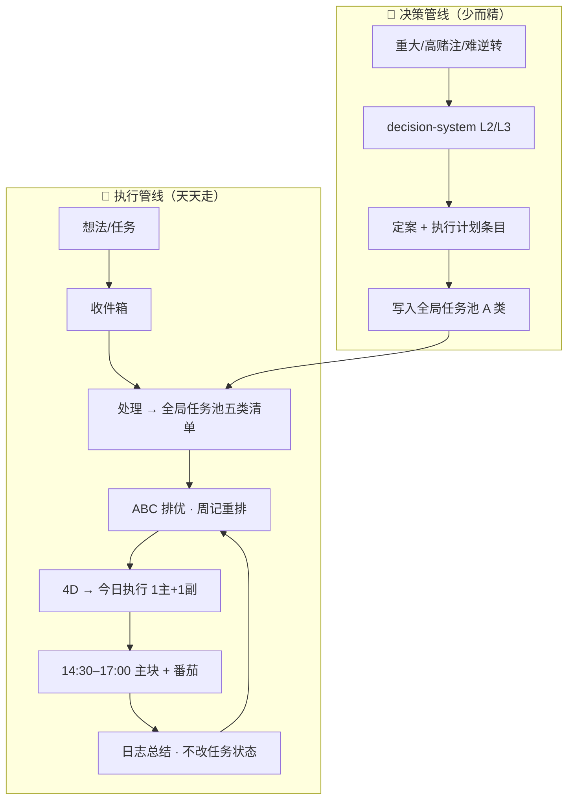

> **用途**：一页整合「科学决策 + 科学执行」——不引入新框架，只串联已有工具该何时、何处使用。
>
> **使用时机**：每天早晨扫 30 秒；不确定「开决策文书还是进任务池」时查第二节；W1 试跑对照第五节。
>
> **关联**：[[时间任务管理统一工作流]] · [[计划执行防护规则]] · [[ABC + 4D工作法判断优先级]] · [[全局任务池]] · [[收件箱]] · `decision-system/`

---

## 一、两条管线（先分流，再行动）

| 管线 | 回答的问题 | 主要工具 |
|---|---|---|
| **决策** | 选哪条路？值不值得赌？ | `decision-system/` |
| **执行** | 今天做什么？怎么不被分散？ | [[全局任务池]] + [[计划执行防护规则]] |

---

## 二、何时开决策系统？（3 条快判）

满足 **任意 2 条** → 用 L2/L3，否则 **只进任务池**：

| # | 条件 | 例子 |
|---|---|---|
| 1 | 影响 **≥1 年** 职业/城市/家庭 | 裸辞后转型方向、是否迁苏州 |
| 2 | **难逆转** 或逆转成本高 | 接受 offer、全家迁居 |
| 3 | **高赌注**（stakes high） | runway、收入、家庭稳定显著受影响 |

**否则**（日常任务、可延期、可撤销）→ 收件箱 → 全局任务池 → 4D，**不开决策文书**。

已生效的 L3 例：`decision-system/10_Decisions/2026-06-10-java-to-ai-agent-engineer.md`  
→ 产出已写入 [[Agent开发学习计划]]，**W1 起不再重议方向，只执行**。

---

## 三、每日节奏（5 + 240 + 10 分钟）

| 时刻 | 动作 | 在哪里 |
|---|---|---|
| **早 09:00–09:30** | 4D 筛选；「今日执行」只填 **1 主 + 1 副** | [[全局任务池]] · 标准块 → `standards/今日执行-DayPlanner标准块.md` |
| **14:30** | 第一个 ▶ 职业番茄 → **主块** | Day Planner |
| **14:30–17:00** | 深度工作主块 | 同上 |
| **22:00–23:00** | 副块（阅读 / 笔记 / 轻整理） | 同上 |
| **全天** | 中断：**停 → 收件箱 → 回** | [[收件箱]] |
| **23:00 后 ~10 min** | 日志三问；任务状态白天已更新 | [[tasks/日志/README|日志]] |

### 晚上复盘三问

1. **主块完成了吗？** 若否 → 登记问题 / 堆叠问题 / 估时问题？
2. **有没有未登记就开工的事？** 若有 → 明天启用防护规则 A。
3. **明天主块是什么？** 备忘即可；明早 4D 正式写入。

---

## 四、4D 与 ABC 怎么配合

| 步骤 | 方法 | 频率 |
|---|---|---|
| 全局排序 | **ABC**（A 必须 / B 应该 / C 可选） | 周记重排 + 整理时标注 |
| 今日筛选 | **4D**（Do / Defer / Delegate / Delete） | **每天早** |
| 今日上限 | 从 Do+Defer 中只取 **1 主 + 1 副** | 每天 |

**4D 快表**

| | 紧急 | 不紧急 |
|---|---|---|
| **重要** | Do → 今日主块 | Defer → 今日副块或排期 |
| **不重要** | Delegate → 等待中 | Delete → 删或将来/也许 |

---

## 五、W1 试跑（W24 · 2026-06-08 一 ~ 06-14 日）✅ 已收官

> **周界**：自然周 **周一~周日** → [[standards/自然周约定|自然周约定]]  
> W1 **成功标准** = JD 调研 + 汇总完成；方法论 **≤3 番茄** 加分项。  
> **结论（2026-06-13）**：W1 ✅ · 155 行 + gap · 6/11 提前完成主块；6/12 起执行焦点 → **Renxin OS V1**（见 [[2026-W24]]、[[Agent开发学习计划]]）。

| 槽位 | 内容 | W24 内节点 |
|---|---|---|
| **主块（13:30–17:00）** | Boss/猎聘 双城 JD → 汇总 → gap | 6/11 ✅ 收官 |
| **副块（二选一）** | A. [[清单革命]] 笔记 · B. 本速查 + W1 试跑表 | 6/11 ✅ 试跑表；6/14 周记定稿 |
| **禁止** | 下午主块做方法论 / 泛搜教程 | — |

### W1 执行试跑表（W24 · 详表在 [[Agent开发学习计划]]）

| 日期 | 主块 | 主块✅ | 备注 |
|---|---|---|---|
| 6/8 一 | （未排）系统搭建 | ❌ | W24 周一 |
| 6/9 二 | 计划任务 | ❌ | 临时挤占 |
| 6/10 三 | L3 定案 | ✅ | 决策 |
| 6/11 四 | W1 JD + gap | ✅ | W1 提前完成 |
| 6/12 五 | 阶段 0 → ChatGPT | ❌ | 转向 Renxin OS |
| 6/13 六 | Renxin OS ①② | ❌ | 非 W1 范围 |
| 6/14 日 | Renxin OS ①② 顺延 | | **W24 末** |

**W25（6/15 一 ~）**：Renxin OS ③④ → V1 可演示。

---

## 六、每周六（~30 min）— 科学执行的校准

1. 对照本周 [[tasks/日志/README|日志/]]：主块完成率、分散原因
2. **ABC 重排** [[全局任务池]]
3. 检查「等待中」「将来/也许」
4. 活跃 **L3 决策**是否需 review（`review_due`）
5. 写 [[tasks/周记/README|周记]] → 下周 **1 个主目标**（通常 = 当前项目阶段）

模板 → [[templates/周记模板|周记模板]]

---

## 七、工具地图（去哪改什么）

| 我要… | 唯一入口 |
|---|---|
| 捕获想法 | [[收件箱]] |
| 增删改任务 / 打勾 / 今日计划 | [[全局任务池]] |
| 重大决策 | `decision-system/10_Decisions/` |
| 上位目标 | `decision-system/50_Reference/Personal-Goals.md` |
| 复杂项目子任务 | [[tasks/projects/README|projects/]] |
| 防分散守则 | [[计划执行防护规则]] |
| 每日总结 | [[tasks/日志/README|日志/]] |
| 每周校准 | [[tasks/周记/README|周记/]] |

**铁律**：任务状态 **只改任务池 / projects**；日志 **只写总结**。

---

## 八、探索型工作预算

每周 **≤2 番茄**：系统优化、模板改造、方法论阅读。  
W1 方法论整合 **额外上限 3 番茄（整周）**，从副块出，**不占 14:30–17:00 主块**。

---

## 九、清单革命 → 本体系的对应（实践出口）

| 书中 | 你已在做 |
|---|---|
| 执行清单 | 今日执行 Day Planner |
| 核查清单 | 决策系统 L3、JD 汇总字段检查 |
| 沟通清单 | 家庭/随迁决策中的利益相关者沟通 |
| 防无能之错 | [[计划执行防护规则]] |

**作品集阶段**：为 Agent demo 加一页 **eval / 上线核查清单**（届时再做，1🍅）。
