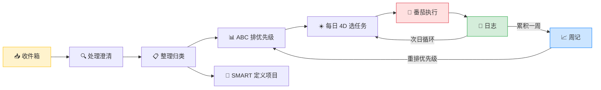

# 时间任务管理统一工作流

> 核心理念：**让大脑只专注于执行，而不是记忆或焦虑。** 建立一个可靠的外部系统来管理所有事务，你才能轻松应对生活与工作。
>
> **知识图谱**：[[收件箱]] · [[全局任务池]] · [[GTD工作法框架]] · [[GTD任务执行规范]] · [[SMART目标管理]] · [[ABC + 4D工作法判断优先级]] · [[番茄执行法]] · [[计划执行防护规则]] · [[决策与执行速查]] · [[阅读与笔记原则]] · [[tasks/日志/README|日志]] · [[tasks/周记/README|周记]] · [[tasks/读书笔记队列|读书笔记队列]]

---

## 一、整体管线

每一步对应的工具和方法：

| 阶段 | 使用工具 | 输入 | 产出 | 预计耗时 |
|---|---|---|---|---|
| 收集 | Obsidian 收件箱笔记 | 任何想法/任务/灵感 | 待处理事项汇总 | 随想随记 |
| 处理 | GTD 澄清四问 | 收件箱内容 | 明确"做什么、是否可执行" | 5~10 分钟/天 |
| 整理 | GTD 五类清单 + SMART | 已处理的任务 | 归入对应清单，项目有 SMART 目标 | 5~10 分钟/天 |
| 排优先级 | ABC 优先级法 | 全局全局任务池 | 按 A/B/C 排序 | 周记时完成 |
| 选今日任务 | 4D 工作法 | ABC 排序后的清单 | 全局任务池「今日执行」区块 | 5 分钟/天 |
| 执行 | 番茄工作法 | 全局任务池「今日执行」 | 25 分钟 × N 个专注块 | 工作时间 |
| 回顾 | 日志 + 周记 | 执行记录 | 文字总结 + 调整后的计划 | 10 分钟 + 30 分钟 |

**关键关系说明**：
- **[[全局任务池]] 是唯一任务管理入口**：五类清单、ABC 优先级、「今日执行」（Day Planner）全部在此
- 「下一步行动」是全局待执行池；「今日执行」是每天 [[ABC + 4D工作法判断优先级|4D]] 筛选后的子集，**勾选只在此处完成**
- **[[tasks/日志/README|日志/]] 只做总结记录**（完成情况、原因、经验、日记），不维护任务 checkbox，避免双份维护
- 复杂项目子任务在 [[tasks/projects/README|projects/]] 勾选；全局任务池只保留概览与下一步行动
- 管线中箭头是主流程，虚线是反馈回路——回顾的分析结论回到全局任务池调整，而非写进日志里的任务列表

---

## 二、第一步：收集（Capture）

**触发时机**：任何时间，有任何想法、任务、灵感、忘不掉的事，立即捕获。

**怎么做**：打开 Obsidian [[收件箱]]，快速写下。不求格式、不求完整，只求不丢失。

**收集的内容包括**：
- 想法（如"想学钢琴"）
- 要做的事（如"预约牙医"）
- 忘不了的事（如"还信用卡账单"）
- 突然冒出的灵感

---

## 三、第二步：处理（Clarify）

**触发时机**：每天工作结束前，或当前无待执行任务时。

**怎么做**：逐条审视收件箱，依次问自己四个问题：

1. **这是什么？** — 想法？具体的任务？忘不掉的事？
2. **我需要做什么？** — 具体行动是什么？
3. **是否可以执行？** — 能执行的进入下一步；不能的丢弃或存档
4. **是否需要拆解？** — 太模糊的复杂任务需要进一步拆分，进入项目列表

**处理判断流程**：

| 判断 | 结果 | 动作 |
|---|---|---|
| 是否可执行？ | 是 | 下一步操作是否明确？明确则进入整理阶段；不明确则拆解 |
| 是否可执行？ | 否 | 丢弃、归档，或放入"将来/也许" |

**示例**：
- "想学 AI" → 模糊，拆解 → "报名某课程 + 每天学习 30 分钟" → 可执行
- "妈妈说要体检" → 明确 → "打电话帮妈妈预约体检时间" → 可执行

---

## 四、第三步：整理（Organize）

**触发时机**：处理步骤完成后立即进行（通常每天一次）。

**怎么做**：将处理后的任务放入对应的清单。

**五类清单**：

| 清单 | 内容 | 说明 |
|---|---|---|
| 📅 日程表 | 有固定时间安排的事 | 已定好的会议、约见等 |
| ✅ 下一步行动 | 明确下一步可执行的任务 | 全局待执行任务池；每日从中筛选 |
| 🔜 等待中 | 依赖他人完成的任务 | 需要跟进但自己做不了 |
| 📂 将来/也许 | 想做但不是现在的事 | 定期回顾，不遗忘 |
| 📦 项目列表 | 需要多步骤完成的复杂事项 | 用 SMART 原则定义目标 |

### 项目目标用 SMART 原则定义

> 在把复杂事项加入"项目列表"时，用 [[SMART目标管理|SMART 原则]]确保目标定义清晰可执行。项目文件模板 → [[项目模板]]。

**SMART 五要素**：

| 维度 | 含义 | 自检问题 |
|---|---|---|
| **S** - Specific | 明确具体 | 目标指什么？不是模糊泛泛的描述 |
| **M** - Measurable | 可衡量 | 怎么知道完成了？有量化标准吗？ |
| **A** - Achievable | 可实现 | 有资源/时间支持吗？ |
| **R** - Relevant | 有相关性 | 和你的核心目标有什么关系？ |
| **T** - Time-bound | 有时限 | 什么时候完成？ |

**示例**：
- ❌ "我要多读书"
- ✅ "未来一个月内，每周读完 1 本时间管理相关的书，并写 100 字以上的笔记"

**注意**：SMART 确保目标的*质量*（清晰、可衡量），但不直接决定*优先级*。一个 SMART 目标可以是低优先级的 C 类——它只说清了你到底要做什么，没说它有多重要。

---

## 五、第四步：排优先级（ABC 优先级法）

**触发时机**：每周记时重新评估，日常整理时可初步标注。

**ABC 分类**：

| 类别 | 含义 | 特征 |
|---|---|---|
| **A 类** | 必须做 | 重要且对核心目标有直接推动作用，不做有严重后果 |
| **B 类** | 应该做 | 有一定价值，但不做短期影响不大 |
| **C 类** | 可做可不做 | 做了更好，不做也无妨 |

**输出**：一份按 ABC 优先级排列的全局全局任务池。

---

## 六、第五步：选今日任务（4D 工作法）

**触发时机**：每天清晨，从已排好优先级的清单中筛选当日执行项。

**4D 四类判断**：

| 重要 / 紧急 | 紧急 | 不紧急 |
|---|---|---|
| **重要** | ✅ **Do it now**（立即做） | 🕒 **Defer**（安排时间延后，同样进入今日清单） |
| **不重要** | 🔁 **Delegate**（委托他人） | ❌ **Delete**（删除/不做） |

**每日操作清单（5 分钟）**：

1. 浏览 ABC 清单，聚焦 A/B 类任务
2. 逐条用 4D 矩阵判断：
   - **Do it now**：立即做的任务
   - **Defer**：安排到今天某个时段，同样列入今日执行清单
   - **Delegate**：移入"等待中"清单
   - **Delete**：直接划掉
3. 从「Do it now」中选出 **3~5 个核心番茄任务**
4. 从「Defer」中确定 1~2 个备选任务（番茄有余力时处理）
5. 为每个番茄任务估算所需番茄数
6. 更新 [[全局任务池]]「今日执行」区块（配合 [[计划执行防护规则]]：每日 **1 主 + 1 副**）

**番茄任务选择原则**：
- 每天至少选 3 个核心番茄任务（来自 A/B 类）
- 每日番茄钟上限 **20 个**
- 按以下时段分配：
  - 清晨 7:30 ~ 9:00：4 个 🍅
  - 上午 9:30 ~ 12:00：5 个 🍅
  - 下午 13:30 ~ 19:00：11 个 🍅

---

## 七、第六步：执行（番茄工作法）

> 核心：**时间单元比任务单元更重要。** 重点在于你完成了多少个专注的番茄钟，而不是每个番茄钟内任务是否完全做完。详见 [[番茄执行法]]。

**番茄钟规则**：
- 1 个番茄 = 25 分钟专注 + 5 分钟短休息
- 每完成 4 个番茄，进行一次长休息（15~30 分钟）
- 一个番茄钟内只做一件事，不允许做任何无关的事
- 未完成的番茄钟无效，中断即作废

**处理中断**：
- **内部中断**（自己的杂念）：快速记下想法到 [[收件箱]]，立即回到任务
- **外部中断**（他人打扰）：示意等一下，保护当前番茄钟

**一个番茄钟内的任务拆得越具体越好**。

**休息原则**：
- 短休息（5 分钟）：彻底放松大脑，不做复杂事务
- 长休息（15~30 分钟）：离开工位，散步、吃东西都可以
- 休息时间一到必须停止，下一个番茄钟准时开始

**消除环境干扰**：手机静音、关闭通知、清理桌面，确保专注。

### 未完成番茄任务的处理

任务预估 2 个番茄但实际远超预估时，不应无限追加——处理方式为：

1. 当日暂停该任务，在日志中**文字记录**估时偏差原因
2. 次日早晨重新评估：是否需要将任务**拆分得更细**？→ 在全局任务池或项目文件中拆分
3. 拆分后重新估算每个子任务的番茄数，加入全局任务池「今日执行」
4. 如果同一任务连续 3 天消耗番茄数都远超预估，考虑是否是任务定义本身有问题（SMART 不清晰）

---

## 八、第七步：回顾（Review）

> 回顾是保持系统"活着的"关键。不回顾，系统会腐烂。

### 日志

**时间**：每天工作结束前（约 10 分钟）

**定位**：只做**总结记录**，不是第二份任务清单。任务打勾、取消、延后已在白天于 [[全局任务池]] 完成。模板 → [[templates/日志模板|日志模板]]；质量验收 → [[templates/质量评估模板|质量评估模板]]。

**内容**：
1. 叙述今天完成了什么（不必复制 checkbox，以全局任务池为准）
2. 哪些任务没完成？原因是什么？→ 需要调整的，**回到全局任务池**改截止日或拆分
3. 番茄钟汇总：计划/实际番茄数、中断原因
4. 估时偏差分析 → 按「未完成番茄任务的处理」流程，次日更新全局任务池
5. 备忘明天最重要的三件事（明早 4D 筛选时正式写入「今日执行」）
6. 新灵感、新任务 → [[收件箱]]

### 周记

**时间**：每周六下午（约 30 分钟）。模板 → [[templates/周记模板|周记模板]]；速查 → [[决策与执行速查]] 第六节。

**内容**：
1. 检查收件箱中还有哪些未处理的事项
2. 重新评估所有任务的 ABC 优先级
3. 检查"等待中"清单：需要跟进吗？
4. 浏览"将来/也许"清单：有需要激活的任务吗？
5. 分析本周番茄数据：
   - 哪些时间段效率最高？→ 安排重要任务到高效时段
   - 经常因什么原因中断？→ 总结应对策略
   - 能否连续专注 4 个番茄？→ 不能则调整期待（如 3 个一组）
6. 更新全局 ABC 优先级排序，反馈到下一步行动清单
7. 调整下周计划

---

## 九、提醒设置（通过系统日历或 Obsidian 插件）

| 时间 | 内容 |
|---|---|
| 每日 7:00 | 打开全局任务池，4D 筛选并更新「今日执行」 |
| 每日 19:00 | 做 10 分钟日志 |
| 每周六 16:00 | 做 30 分钟周记 |

---

## 十、非工作日处理

周末和节假日不需要严格执行完整流程，但建议保持**最小维护**：

- **收件箱**：有新想法仍然随时记录，不丢失
- **日志**：可跳过或简化为 2 分钟快速检查
- **周记**：如果周六有安排，可提前到周五或延到周日，但不要跳过

---

## 十一、方法对照速查

| 方法 | 作用 | 使用时机 | 每次耗时 | 核心输出 |
|---|---|---|---|---|
| GTD 收集 | 清空大脑，不遗漏任何事 | 任何时间 | 随想随记 | 收件箱条目 |
| GTD 处理 | 澄清"这是什么、要不要做" | 每天结束前 | 5~10 分钟 | 已处理的任务 |
| GTD 整理 | 归类到五类清单 | 处理后立即 | 5~10 分钟 | 五类清单元 |
| SMART 原则 | 确保项目目标清晰可衡量 | 定义项目时 | 2~3 分钟/项 | SMART 目标描述 |
| ABC 优先级法 | 全局任务排序 | 周记时重排 | 10~15 分钟 | A/B/C 排序清单 |
| 4D 工作法 | 每日筛选执行任务 | 每天清晨 | 5 分钟 | 全局任务池「今日执行」 |
| 番茄工作法 | 专注执行时间块 | 工作时间 | 25+5 分钟/个 | 在全局任务池勾选 + 番茄记录 |
| 日志 | 当天复盘总结 | 每天结束前 | 10 分钟 | 叙述性总结 + 经验 + 明日备忘 |
| 周记 | 全局调整和趋势分析 | 每周六下午 | 30 分钟 | 更新优先级 + 下周计划 |
