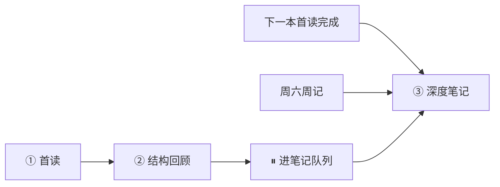

> **用途**：读书类项目的**方法论原则**——读得完、记得住、用得上，又不挤占职业主块。
>
> **定位**：与 [[计划执行防护规则]]、[[决策与执行速查]] 并列的补充守则；执行细则 → `standards/gtd-reading.md` · 队列 → [[tasks/读书笔记队列|读书笔记队列]]
>
> **关联**：read30 习惯 · `projects/` 读书项目 · [[个人运行原则]] · [[常犯的错误]]

---

## 核心理念

**首读求吞吐，结构求锚点，笔记求间隔。**

读完立刻写全书大纲，容易变成第二份工作且长期 defer。更有效的是：**首读不深记 → 48 小时内轻回顾锁结构 → 隔一本书（或周记触发）再写实践笔记**。第二本书读完后，第一本的笔记是与**当前目标对话**，而非复述章节。

---

## 三阶段

| 阶段 | 目标 | 时段 | 耗时 | 完成标志 |
|---|---|---|---|---|
| **① 首读** | 读完；允许书上划线，不在项目里写长笔记 | read30 / 副块 | 多日 · 30min/天 | 勾「全书首读完成」 |
| **② 结构回顾** | 合上书仍能说清框架；**不是**逐章大纲 | 副块 | **1🍅** · 首读后 **48h 内** | 填「全书一页纸」+ 挂钩 **1 行** |
| **③ 深度笔记** | 实践笔记 + 与体系挂钩；有边界地扩章 | 副块 | **2–4🍅**/本 | 挂钩表补全 + 个人例子 ≥1 |

**铁律**：② 不可跳过（否则 ③ 又会写成大而全）；③ **不占 14:30–17:00 主块**。

---

## ② 结构回顾：只产出什么

| 产出 | 上限 | 内容 |
|---|---|---|
| **全书一页纸** | 4 行 | 解决什么问题 · 3 关键词 · 1 句对我意味着什么 · （可选）全书框架一行 |
| **结构自检** | 5 行 | 对照项目章节表：各部分各讲什么（口述或短写） |
| **体系挂钩** | **1 行** | 填项目内「与现有体系挂钩」表一行（例：清单革命 → 防护规则） |

**禁止**：逐章书摘、超过 1🍅、占主块。

---

## ③ 深度笔记：何时做

满足 **任一** 即排进副块：

| # | 触发条件 |
|---|---|
| 1 | **默认**：下一本书 **① 首读也完成** → 回来写上一本 |
| 2 | **周六周记**：笔记队列 ≥1 本，且本周主块完成率 ≥3/5 |
| 3 | **主动挂钩**：该书概念直接用于当前 A 类（例：Renxin OS eval → 补《清单革命》核查清单） |

**队列规则**：同时 **深度笔记最多 1 本**（防堆叠）。

---

## ③ 深度笔记：写什么

| 做 | 不做 |
|---|---|
| 从「一页纸」出发，只扩**仍模糊**或**与当前目标相关**的章 | 每章全面书摘 |
| 每章上限：**2 观点 + 1 实践** | 复制目录当笔记 |
| 必做：**个人例子 1 个** + **挂钩表补全** | 无挂钩的摘要 |

可提炼条目 → [[standards/个人运行原则|个人运行原则]] 或 [[常犯的错误]]（经周记确认）。

---

## 与 GTD 的衔接

| 体系位置 | 读书三阶段 |
|---|---|
| `habits/read30` | 只服务 **① 首读** |
| `projects/*.md` | 章节表 = 地图；一页纸 / 挂钩表 = ②③ 产出区 |
| [[tasks/读书笔记队列\|读书笔记队列]] | 全库队列；**不**镜像 A/B |
| 全局池「将来/也许」 | 仅索引「待深度笔记的书名」 |
| [[tasks/周记/README\|周记]] | 扫队列、决定是否触发 ③ |

---

## 禁止项

- ❌ 首读阶段在项目文件写逐章长笔记
- ❌ 用「整理笔记」挤占 14:30–17:00 主块
- ❌ 跳过 ② 直接做 ③
- ❌ 队列里同时深度笔记 2+ 本
- ❌ 无实践挂钩的纯摘要（不算完成 ③）

---

## 与上升螺旋的对应

| 达利欧式循环 | 读书阶段 |
|---|---|
| 输入 | ① 首读 |
| 痛苦 + 反思 | ② 结构回顾（我读懂了吗） |
| 原则提炼 | ③ 深度笔记 → 个人运行原则 / 防护规则 |
| 行为改变 | 挂钩表落地到 tasks / standards |
